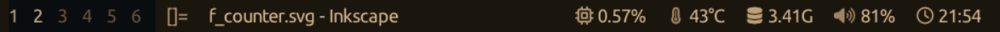

# btrbar
**A bar for dwl.**  


Fork of [julmajustus/btrbar](https://github.com/julmajustus/btrbar)


## Changes
- Text is centered vertically instead of at the top of the bar
- Removed some blocks from the default bar (like wattage and GPU temp)
- Used Ubuntu Nerd font instead of the bloated Iosevka font
- Used charcoal colors, inspired by [mubin6th](https://github.com/mubin6th/charcoal)'s theme
- added a RGBA function to describe colors in RGBA instead of ARGB (see `config.h`)

## Building & Installing

### Dependencies

- **[dwl](https://codeberg.org/dwl/dwl)** (with [ipc](https://codeberg.org/dwl/dwl-patches/src/branch/main/patches/ipc) patch if you enable TAGS, LAYOUT, or TITLE blocks)  
- **wayland-protocols** & **pkg-config**  
- **wlroots**  
- **libdbus-1** (if TRAY support is enabled)  
- **[stb lib](https://github.com/nothings/stb)**: stb_truetype.h, stb_image.h, stb_image_resize2.h (already bundled in `include/`)

```bash
git clone -b centerVertically https://github.com/dyf-bits/btrbar.git
cd btrbar

# Build
make release

# Install to /usr/local/bin
sudo make install

# Uninstall
sudo make uninstall

# Full clean
make fclean
```

## Configuration

All settings and block definitions live in include/config.h.  


